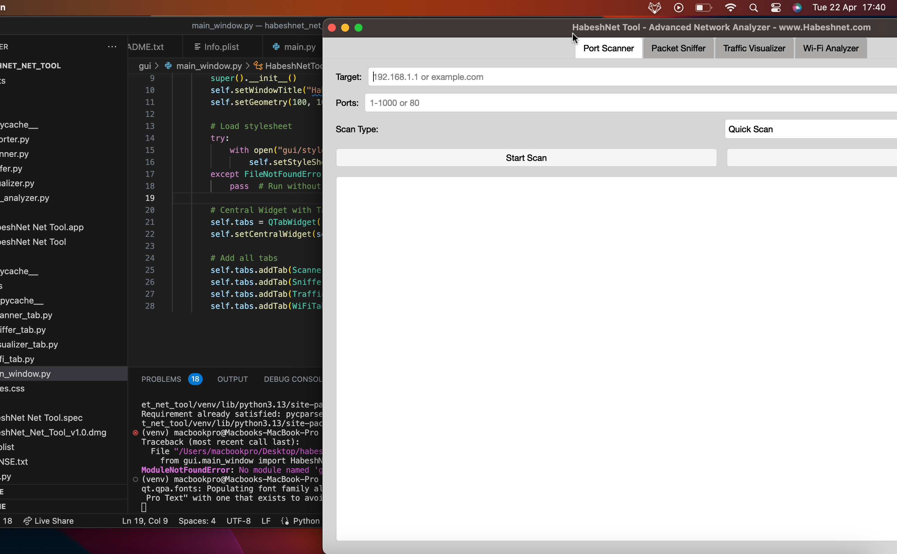

# 🔍 HabeshNet Net Tool - Professional Network Analysis tool

  
*Advanced network diagnostics at your fingertips*


## 🌟 Features
| Feature | Description |
|---------|-------------|
| 🎯 **Port Scanner** | Lightning-fast TCP/UDP port scanning with Nmap integration |
| 📡 **Packet Sniffer** | Real-time traffic analysis with protocol decoding |
| 📊 **Traffic Visualizer** | Live bandwidth monitoring with interactive graphs |
| 📶 **Wi-Fi Analyzer** | macOS wireless network inspector (channel, signal strength) |
| 🔒 **License Protection** | Secure activation system for authorized use |

## 🚀 Quick Start

### 📥 Download
- The DMG file from here

## 📸 Screenshots
| Feature | Preview |
|---------|---------|
| **Port Scanner** |  |
| **Packet Sniffer** |  |
| **Traffic Visualizer** |  |
| **Wi-Fi Analyzer** |  |

### 💻 System Requirements
- **macOS 12.0+** (Intel/Apple Silicon)
- 50MB free disk space
- Admin privileges for full functionality

### 🛠️ Installation
1. Download the `.dmg` file
2. Double-click to mount the disk image
3. Drag `HabeshNet Net Tool.app` to your Applications folder  
   *(First launch: Right-click → Open to bypass Gatekeeper)*

---
# 🔒 Legal Notice

**Copyright © 2025 Dawit Asmerawork. All Rights Reserved.**

The HabeshNet Net Tool software and documentation are protected under copyright laws.  
Unauthorized reproduction, distribution, or modification is strictly prohibited.

## Permissions
✅ **Allowed**:  
- Personal/educational use with original license  
- Forking for bug reporting (with attribution)  

🚫 **Prohibited**:  
- Commercial redistribution  
- Reverse engineering  
- Removing license notices  

*For licensing inquiries, contact: [david@habeshnet.com](mailto:david@habeshnet.com)*  

[View Full License](LICENSE.txt)

```bash
# Optional terminal launch
open /Applications/HabeshNet\ Net\ Tool.app

